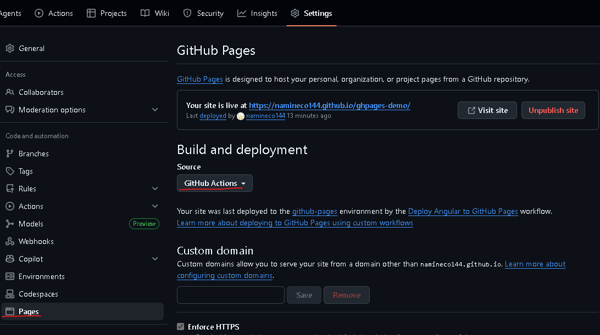

# GitHub PagesへのAngularアプリデプロイメント

このドキュメントは、`ghpages-demo` プロジェクトをGitHub Pagesにデプロイするためのワークフロー (`deploy.yml`) について詳しく説明します。

## ワークフロー概要

GitHub Actions ワークフロー ([.github/workflows/deploy.yml](.github/workflows/deploy.yml)) は、mainブランチへのプッシュ時に自動的にAngularアプリをビルドし、GitHub Pagesにデプロイします。

### 実行フロー

```
[プッシュ] → [リポジトリチェックアウト] → [Node.jsセットアップ] 
→ [依存関係インストール] → [ビルド] → [アーティファクトアップロード] 
→ [GitHub Pagesにデプロイ]
```

---

## ワークフロー詳細解説

### 1. トリガー設定

```yaml
on:
  push:
    branches:
      - main
```

**説明:**

- `main` ブランチへのプッシュ時にワークフローを実行
- 他のブランチへのプッシュではワークフローが起動しません

---

### 2. パーミッション設定

```yaml
permissions:
  contents: read      # リポジトリの読み取り
  pages: write        # GitHub Pagesへの書き込み
  id-token: write     # OIDC トークン発行（セキュアなデプロイ用）
```

**説明:**

- ワークフロー実行に必要な最小限の権限を設定
- セキュリティのベストプラクティスに準拠

---

### 3. ビルドジョブ

#### 3.1 リポジトリのチェックアウト

```yaml
- name: リポジトリのチェックアウト
  uses: actions/checkout@v5
```

**説明:**

- GitHub リポジトリのコードをランナーに取得

#### 3.2 Node.jsのセットアップ

```yaml
- name: Node.jsのセットアップ
  uses: actions/setup-node@v6
  with:
    node-version: '24'
    cache: 'npm'
```

**説明:**

- Node.js v24 をインストール
- `cache: 'npm'` により `node_modules` をキャッシュし、次回以降のインストールが高速化される

#### 3.3 依存関係のインストール

```yaml
- name: 依存関係のインストール
  run: npm ci --prefer-offline --no-audit --no-fund
```

**説明:**

- `npm ci`: 本番環境向けのクリーンインストール（`package-lock.json` に基づいて再現性を確保）
- `--prefer-offline`: ネットワークの代わりにローカルキャッシュを優先使用
- `--no-audit`: 脆弱性監査を省略（速度優先）
- `--no-fund`: 寄付メッセージ表示を省略

#### 3.4 Angularアプリのビルド

```yaml
- name: Angularアプリのビルド
  run: npm run build -- --base-href=/${{ github.event.repository.name }}/
```

**説明:**

- `npm run build`: 本番ビルドを実行
- `--base-href=/${{ github.event.repository.name }}/`: アプリケーションの基本URL を設定

##### ⚠️ `--base-href` の重要性

GitHub Pages の URL は `https://<username>.github.io/<repository-name>/` となるため、`--base-href` の設定が **必須** です。

**`--base-href` を指定しない場合:**

- アプリケーションのリソース（CSS、JS、画像）が間違ったパスを参照
- ルーティングが正常に動作しない
- **ページが真っ白または部分的にしか表示されない**

**正常な設定:**

```bash
npm run build -- --base-href=/ghpages-demo/
```

- すべてのリソースが `/ghpages-demo/` 以下を基準に参照
- ルーティングが正常に動作

**例: `index.html` のスクリプトタグ参照**

```html
<!-- --base-href 未設定の場合 -->
<script src="/main.js"></script>  <!-- ❌ 404エラー -->

<!-- --base-href=/ghpages-demo/ の場合 -->
<script src="/ghpages-demo/main.js"></script>  <!-- ✅ 正常に読み込み -->
```

**動的にリポジトリ名を取得:**

```yaml
${{ github.event.repository.name }}
```

- ワークフロー内で自動的にリポジトリ名（`ghpages-demo`）を取得
- ハードコード不要で、他のリポジトリでもワークフローが流用可能

#### 3.5 ビルド成果物のアップロード

```yaml
- name: ビルド成果物のアップロード
  uses: actions/upload-pages-artifact@v4
  with:
    path: ./dist/${{ github.event.repository.name }}/browser
```

**説明:**

- `./dist/ghpages-demo/browser/` 内のビルド済みファイル（静的HTML、CSS、JS）をGitHub Actions の一時ストレージにアップロード
- デプロイジョブで使用するため

---

### 4. デプロイジョブ

```yaml
deploy:
  environment:
    name: github-pages
    url: ${{ steps.deployment.outputs.page_url }}
  runs-on: ubuntu-latest
  needs: build
  steps:
    - name: Deploy to GitHub Pages
      id: deployment
      uses: actions/deploy-pages@v4
```

**説明:**

- `needs: build`: ビルドジョブが成功してから実行
- `uses: actions/deploy-pages@v4`: GitHub Pages に成果物をデプロイ
- `url`: デプロイ後のページURL を出力

---

## GitHub Pages の設定

デプロイを開始する前に、リポジトリの GitHub Pages 設定が正しく構成されている必要があります。

### 設定手順

1. **リポジトリのページを開く**
   - GitHub で `ghpages-demo` リポジトリにアクセス

2. **Settings タブをクリック**
   - リポジトリページの右上にある **Settings** をクリック

3. **Pages ページに移動**
   - 左サイドバーから **Pages** を選択

4. **Build and deployment セクションを確認**

   **Source の設定:**
   - ドロップダウンで **GitHub Actions** を選択

   
5. **保存**
   - GitHub Pages がこれ以上変更を要求しない場合、自動的に保存されます

### 設定後の動作

- `main` ブランチへのプッシュで自動的にワークフローが実行
- ビルド完了後、GitHub Pages に自動デプロイ
- `https://<username>.github.io/<repository-name>/` でアプリにアクセス可能

### よくある設定ミス

❌ **Source が `Deploy from a branch` になっている**

- これでは GitHub Actions ワークフローからのデプロイが機能しません
- **GitHub Actions** を選択してください

---

## トラブルシューティング

### ページが真っ白に表示される

**原因:**

- `--base-href` が正しく設定されていない
- ルーティングが GitHub Pages のパスに対応していない

**対策:**

1. `deploy.yml` で `--base-href` が設定されているか確認
2. `Angular Router` の `RouterModule` で `useHash: true` を検討
3. ビルド成果物のパス （`./dist/ghpages-demo/browser/`）が正しいか確認

### リソース（CSS、JS）が読み込まれない

**原因:**

- `--base-href` の値がビルド時と GitHub Pages の URL に一致していない

**確認方法:**

1. ブラウザの開発者ツール（DevTools）でネットワークタブを確認
2. 404エラーが出ているリソースのURLをチェック
3. GitHub Pages 設定で `gh-pages` ブランチが正しく指定されているか確認

---

## 参考資料

- [Angular - Deployment](https://angular.dev/guide/deployment)
- [GitHub Pages - Configuring a publishing source](https://docs.github.com/en/pages/getting-started-with-github-pages/configuring-a-publishing-source-for-your-github-pages-site)
- [GitHub Actions - Caching dependencies](https://docs.github.com/en/actions/using-workflows/caching-dependencies-to-speed-up-workflows)
